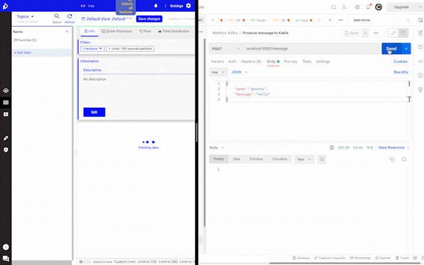
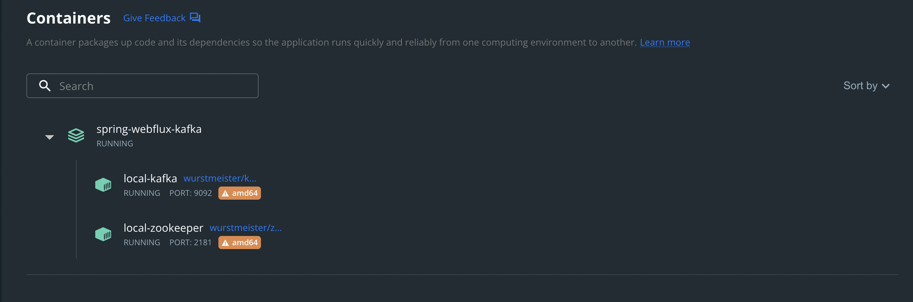
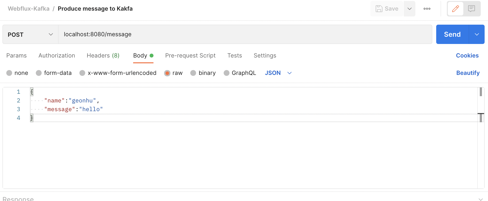
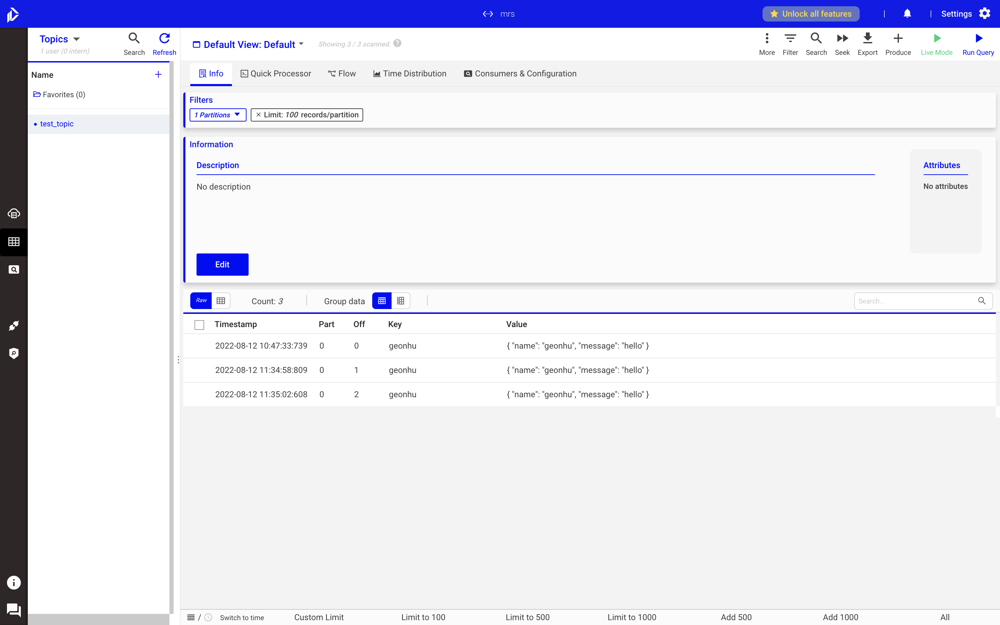

# Spring-webflux-Kafka



## Summary

Spring webflux를 이용해서 Apache Kafka에 메시지를 발행하는 프로젝트. Spring Webflux를 사용해 Controller 에서 /message 로 POST 요청을 통해 Kafka에 메시지를 발행할 수 있게 하였다. Reactor Kafka API를 사용하였는데, 이는 Non-blocking 백프레셔(back pressure)와 낮은 오버헤드로 Kafka에 메시지를 발행할 수 있기 때문이다.


## How to use?

### Docker 를 통한 Single broker 카프카 클러스터 구성, 서버 실행



```
docker compose up -d
```

docker-compose.yml 에서 `test_topic` 을 Replication 1개, Partition 1개로 설정하였다. 


### Postman을 통한 Spring Webflux 서버에 POST 요청 보내기



localhost:8080/message URL에 POST 요청으로 body에 위와 같은 형식으로 요청을 전송한다. Spring Webflux 프로젝트에서 설정한 URL에 매칭되는 컨트롤러가 Kafka에 메시지를 발행한다.


### KaDeck을 통한 메시지 발행 여부 확인하기



KaDeck 어플리케이션을 통해 특정 토픽(test_topic)에 발행된 메시지를 볼 수 있고, Live mode를 통해서 postman으로 메시지를 POST 요청할 때마다, 메시지가 적재되는 것을 볼 수 있다. 

 

## 왜 Spring Webflux와 Reactor Kafka를 사용하였는가?

### Non-blocking Back-pressure

Reactor Kafka API는 Reactor에서 제공하는 non-blocking back-pressure 를 통한 이점을 볼 수 있다. 예를 들어 Kafka에 메시지를 발행하는 외부 데이터 파이프라인(HTTP 요청을 통해) 이 있을 때, back-pressure를 적용할 수 있는데 inflight 메시지와 메모리 사용량을 조절할 수 있다.


### High Performance

Spring MVC의 경우, 하나의 요청에 하나의 쓰레드가 사용(Thread per Request)된다. 그래서 많은 요청에 대비할 수 있도록 쓰레드 풀(Thread pool)을 생성해놓는다. 스레드 스택은 기본적으로 (sleep 이외에는 아무것도 하지 않는 경우) 16KB의 물리적 램을 사용하고, 이는 JVM 스레드의 기본 오버헤드다. 만약 많은 요청이 동시에 들어온다면, 메모리 사용량이 급격하게 늘어날 것이다.

그렇지만 Spring Webflux의 경우, NIO와 고정된 쓰레드 수를 통해 다수의 요청을 처리한다. 싱글 쓰레드로 구성된 이벤트 루프(Event Loop) 기반 Webflux는 Blocking 이 생기면 Webflux의 장점을 잃어버린다. Blocking method로 인해 여러 채널에서 들어오는 모든 요청이 지연되는 상황을 `Reactor meltdown `이라고 하는데, 이벤트 루프 싸이클 중 한쪽 싸이클에 지연이 발생하면 전체 루프에 영향을 미치는 상황을 말한다.


